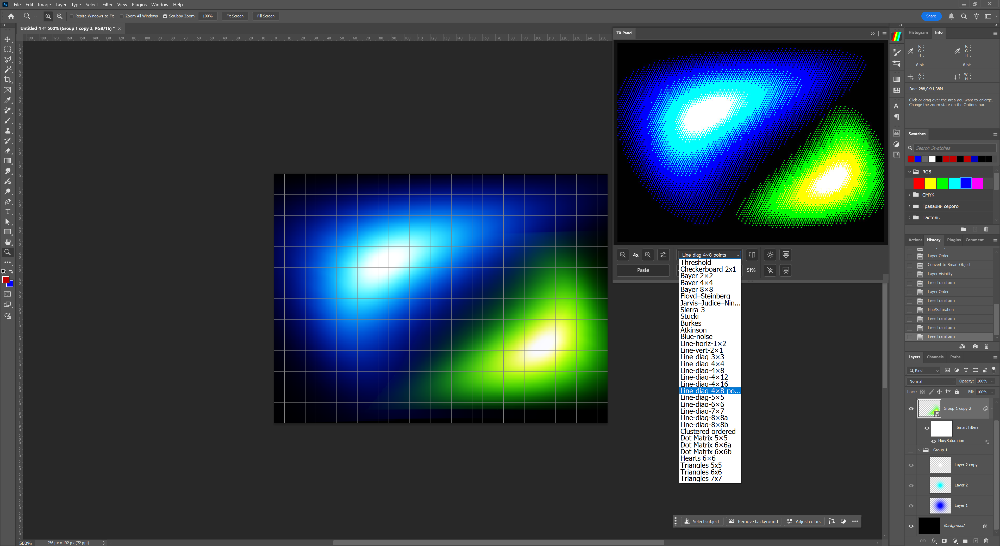

ZX Panel

ZX Panel is a real-time image processing plugin for Adobe Photoshop that transforms your artwork into a native ZX Spectrum screen format — instantly and non-destructively.

Whether you're creating loading screens, game assets, or retro-futuristic art — ZX Panel brings an authentic 8-bit experience directly into your modern workflow.

✨ Features

Live ZX Spectrum preview inside Photoshop

Non-destructive editing — works with layers, masks, adjustment layers, shapes, smart objects

Fixed ZX output regions with optional masking

50+ curated dithering patterns (matrix, pattern, diffusion, etc.)

Flash attributes on a dedicated layer

Bright mode (global or auto-enabled per attribute)

Import/export .scr files directly from the panel

📦 Installation

Download the latest .ccx file from Gumroad or Adobe Marketplace.

Double-click the .ccx to install via the Creative Cloud Desktop app.

In Photoshop, go to Plugins > ZX Panel to launch.

📘 Documentation

User Guide (comnig soon)

FAQ (coming soon)

Video tutorial (coming soon)

🐞 Support

If you encounter issues or want to suggest a feature, feel free to open an issue or contact us:

Email: [neznany+zxpanel@gmail.com]

GitHub Issues: github.com/neznany/ZX-Panel-PS-UXP-Plugin/issues
