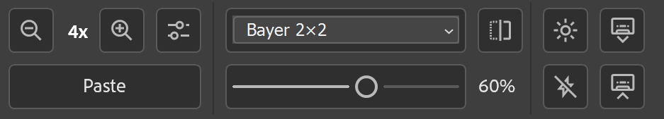
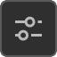

# ZX Panel — Help & User Guide

**ZX Panel** is a real-time image processing plugin for Adobe Photoshop that transforms your document into a native **ZX Spectrum screen format**, non-destructively and instantly.

---

## General Info

ZX Panel is designed for artists creating ZX Spectrum graphics. It automates all attribute-related limitations (clash rules, color limits, bright/flash attributes, etc.), while retaining the full power of Photoshop's layer-based workflow.

Compatible with:

* 8-bit or 16-bit RGB documents
* Sizes from **8×8 px up to 512×384 px**, in **8-pixel steps** (width and height must be divisible by 8)

If the current document does not meet these criteria, the preview will show a message indicating unsupported format.

---

---

## Preview Panel

The large central preview displays the real-time ZX-converted version of the currently active document.

To ensure **sharp, crisp pixels** without moiré artifacts, press **System Scale Adjustment Button**  and select the correct system scale (matches your OS settings).

Below are **Zoom Out**  and **Zoom In**  buttons, controlling preview scale (1x to 4x).

---

## Paste Button

**Paste** inserts a rendered copy of the preview into a new layer (useful to fix parts of your artwork into ZX format mid-process).

---

## Dithering Panel

* **Dropdown Menu**: Choose a dithering algorithm that best suits your artwork.
* **Flip Button** : Available for algorithms that support horizontal mirroring.
* **Strength Slider**: Controls dithering intensity (0%–100%). With threshold selected, it acts as brightness cutoff level.

---

## Attribute Controls

**Bright Button** :

* Toggles bright mode: off / on / auto-detect per attribute block.

**Flash Button** :

* Activates flash layer mode.
* ZX Panel will look for a layer named `FLASH` (or create one if missing).
* Any pixels painted in this layer (at least one per 8×8 block) will mark the block as flashing.
* If only one color is present in a block, the second flash color will be automatically picked from painted pixels in the FLASH layer.
* You can **hide** or move this layer back to avoid affecting the image pixels.

---

## Import / Export

**Import** :

* Load a standard `.scr` (6912 bytes) screen file — output will be placed in a new layer.

**Export** :

* Save the current document as a `.scr` file.
* If smaller than 256×192 px, it will be padded with black.
* If larger, it will be **split** into 2 or 4 `.scr` files accordingly.

---

## 💡 Tips

* Work in **16-bit mode** for cleaner gradients.
* Disable Photoshop's own **dithering** for brushes and gradients to avoid unwanted noise.

---

## 💬 Contacts

E-mail: [zxpanel.dev@gmail.com](mailto:zxpanel.dev@gmail.com) 
GitHub: [github.com/Neznany/ZX-Panel-PS-UXP-Plugin](https://github.com/Neznany/ZX-Panel-PS-UXP-Plugin)
